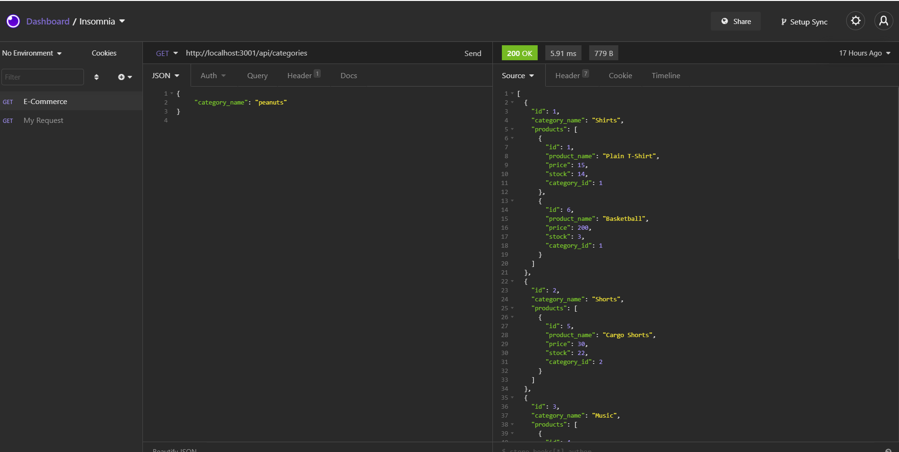

# 13-ORM-E-Commerce-Back-end

# Description
My task was to build the back end for an e-commerce site by modifying starter code. I configured a working Express.js API to use Sequelize to interact with a MySQL database.

# Table of Contents
1. [Title](Title)
2. [Description](#description)
3. [Installation](#installation)
4. [Contributing](#contribution)
5. [Questions](#questions)
6. [License](#license)
7. [Demo](#Demo)
8. [Screenshot](#screenshot)
# Installation 
I used 'npm i' to insall all required pacakages.
# Contribution
Myself
# Questions
## GitHub 
 Lyndseyfin
## Email 
 lyndseyfinamore@gmail.com
## License

## Demo
<a href="https://www.youtube.com/watch?v=vU4fVzlI0mA">ORM E-Commerce</a>

## Screenshot

